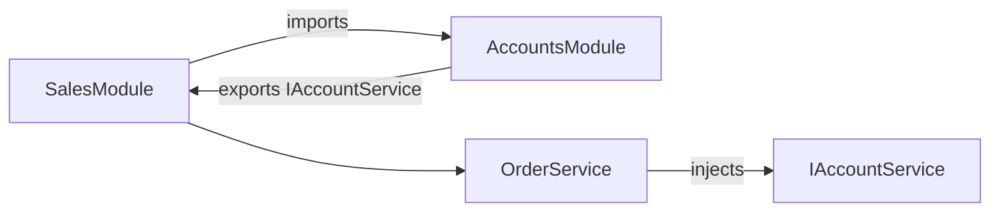
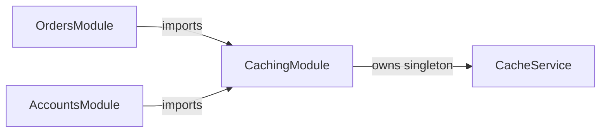
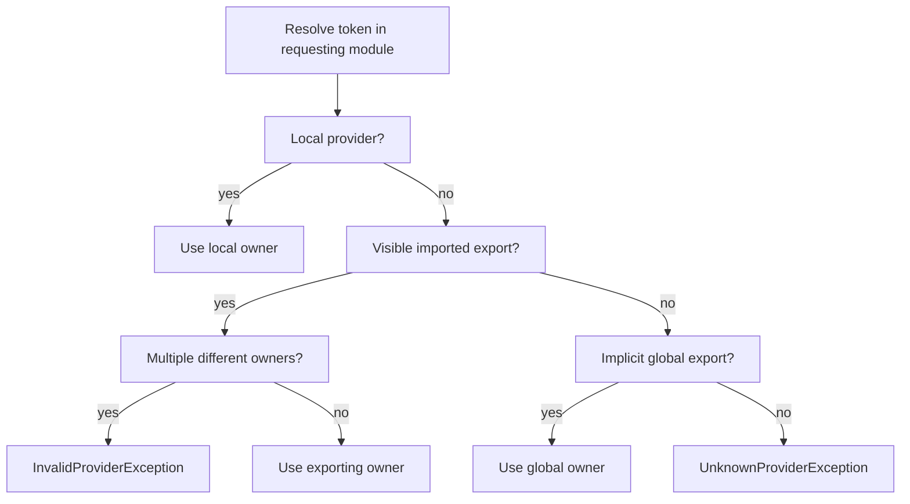
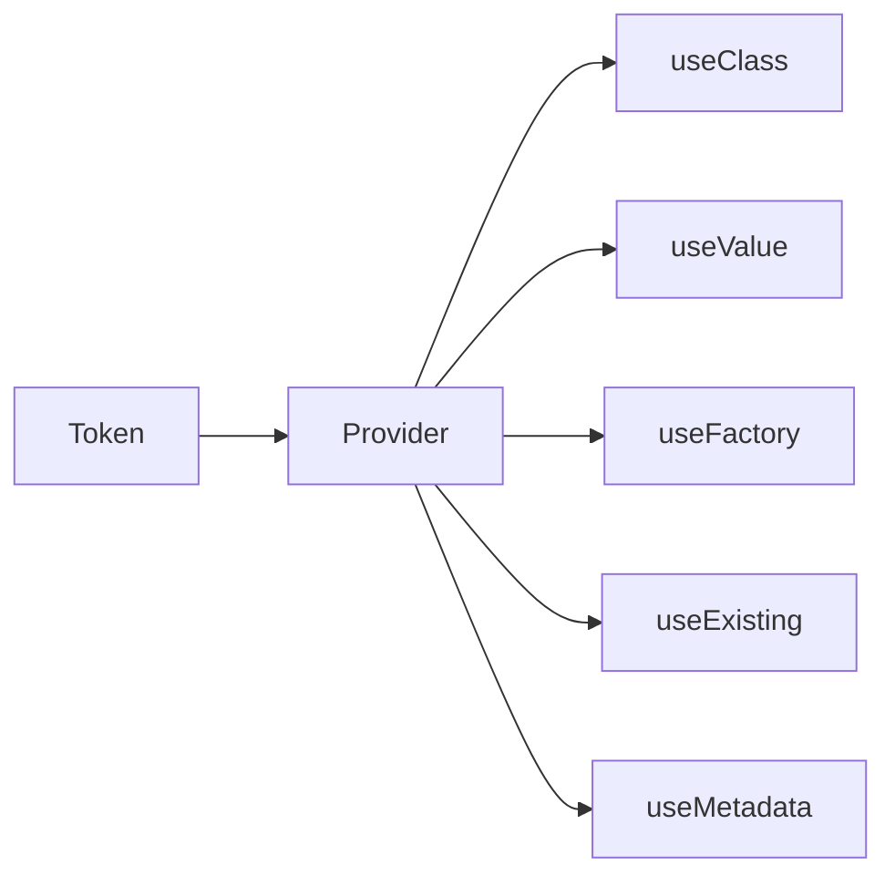
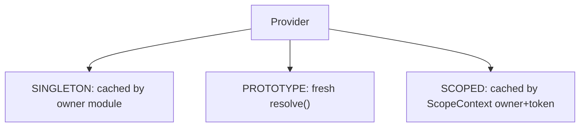
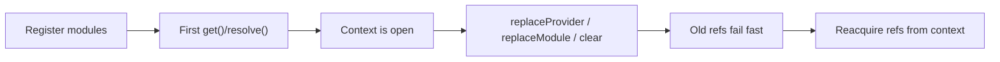

# Apex DI


[](https://github.com/berehovskyi/apex-di/actions/workflows/validate.yml)
[](https://github.com/berehovskyi/apex-di/actions/workflows/validate.yml)

A modular, NestJS-inspired dependency injection framework for Salesforce Apex.

Apex DI lets you organize application code into modules, bind tokens to providers, and resolve services through a module-aware container. It is designed for Apex's transaction model: setup happens inside one transaction, provider instances are cached only inside that transaction, and module graphs can be isolated with explicit [application contexts](#application-context).

## Table of Contents

- [Installation](#installation)
- [Quick Start](#quick-start)
- [Modules](#modules)
    - [Feature Modules](#feature-modules)
    - [Imports](#imports)
    - [Exports](#exports)
    - [Shared Modules](#shared-modules)
    - [Re-exports](#re-exports)
    - [Visibility Rules](#visibility-rules)
- [Global Modules](#global-modules)
    - [Metadata-selected Modules](#metadata-selected-modules)
    - [Metadata Global Modules](#metadata-global-modules)
- [Dynamic Modules](#dynamic-modules)
- [Providers](#providers)
    - [Provider Tokens](#provider-tokens)
    - [Class Providers](#class-providers)
    - [Value Providers](#value-providers)
    - [Factory Providers](#factory-providers)
    - [Alias Providers](#alias-providers)
    - [Metadata Providers](#metadata-providers)
    - [Metadata Sources](#metadata-sources)
- [Dependency Resolution](#dependency-resolution)
    - [get()](#get)
    - [resolve()](#resolve)
    - [tryGet() and tryResolve()](#tryget-and-tryresolve)
    - [Automatic Injection](#automatic-injection)
    - [Manual Injection](#manual-injection)
    - [Circular Dependencies](#circular-dependencies)
        - [Supported: Injectable Singleton References](#supported-injectable-singleton-references)
        - [Avoid: Circular Factory Construction](#avoid-circular-factory-construction)
        - [Module Import Cycles](#module-import-cycles)
        - [Re-export Cycles](#re-export-cycles)
    - [Resolution Errors and Paths](#resolution-errors-and-paths)
- [Scopes](#scopes)
    - [Singleton Scope](#singleton-scope)
    - [Prototype Scope](#prototype-scope)
    - [Scoped Providers](#scoped-providers)
    - [ScopeContext](#scopecontext)
- [Application Context](#application-context)
    - [Context Lifecycle](#context-lifecycle)
    - [Graph Mutation](#graph-mutation)
    - [Clearing Contexts](#clearing-contexts)
    - [Compiled Graphs](#compiled-graphs)
- [Diagnostics](#diagnostics)
    - [explain()](#explain)
    - [describe()](#describe)
    - [Common Resolution Problems](#common-resolution-problems)
    - [Exceptions](#exceptions)
- [Testing](#testing)
- [Design Notes](#design-notes)
- [Documentation](#documentation)

## Installation

Deploy the framework metadata into the target org:

```sh
sf project deploy start -d sfdx-source/apex-di -o <org-alias>
```

Or install as an unlocked package:

```sh pkg::apex-di
sf package install -p 04tfj000000LjuzAAC -o <org-alias> -r -w 10
```

## Quick Start

Create a module, register a provider, and resolve it from an entry point:

```apex
public class AccountsModule extends Di.Module {
    public override Set<Di.Provider> providers() {
        return new Set<Di.Provider>{
            provide(IAccountService.class).useClass(AccountService.class)
        };
    }

    public override Set<String> exports() {
        return new Set<String>{ IAccountService.class.getName() };
    }
}

public with sharing class AccountController {
    @AuraEnabled
    public static List<Account> getAccounts() {
        Di.ModuleRef ref = Di.getModuleRef(AccountsModule.class);
        IAccountService service = (IAccountService) ref.get(IAccountService.class);
        return service.findAll();
    }
}
```

`Di.getModuleRef(...)` uses the default [application context](#application-context). This is the simplest entry-point pattern for controllers, trigger handlers, and other top-level Apex code.

## Modules

A module is a class that extends `Di.Module`. It groups a cohesive set of providers and defines which of them are visible to other modules.

Every module can declare four things:

| Method        | Purpose                                                                       |
| ------------- | ----------------------------------------------------------------------------- |
| `providers()` | Providers owned by this module                                                |
| `imports()`   | Other modules whose [exported](#exports) providers are visible to this module |
| `exports()`   | Provider tokens this module exposes as its public API                         |
| `reexports()` | Imported modules whose exports should be exposed again by this one            |

By default, providers are private to the module that declares them. Another module can use them only when they are exported and imported.



### Feature Modules

Feature modules are the normal way to organize application code. A feature module owns the providers for one domain and exports only the providers that form its public API.

```apex
public class AccountsModule extends Di.Module {
    public override Set<Di.Provider> providers() {
        return new Set<Di.Provider>{
            provide(IAccountService.class).useClass(AccountService.class),
            provide(AccountRepository.class).useClass(AccountRepository.class)
        };
    }

    public override Set<String> exports() {
        return new Set<String>{ IAccountService.class.getName() };
    }
}
```

In this example, `IAccountService` is the exported provider token, and `AccountService` is the concrete class behind that token. `AccountRepository` stays private and can be injected only inside `AccountsModule` providers.

### Imports

Import a module when the current module needs access to another module's exported providers:

```apex
public class SalesModule extends Di.Module {
    public override Set<Di.ModuleImport> imports() {
        return new Set<Di.ModuleImport>{ Di.import(AccountsModule.class) };
    }
}
```

Imports are **lazy** by default. The imported module is registered only when a provider path needs it, so unused feature modules do not pay setup cost in a transaction. Mark an import with `.immediately()` when the module should be validated and registered together with its owner, for example when you want a missing import or invalid export to fail during module setup instead of the first provider lookup:

```apex
public override Set<Di.ModuleImport> imports() {
    return new Set<Di.ModuleImport>{ Di.import(AccountsModule.class).immediately() };
}
```

`immediately()` is a marker. Calling it on a standalone `ModuleImport` does not mutate an application context.

### Exports

Exports are provider tokens, not implementation classes. If a provider is bound under an interface token, export the interface token:

```apex
public class LoggingModule extends Di.Module {
    public override Set<Di.Provider> providers() {
        return new Set<Di.Provider>{ provide(ILogger.class).useClass(ConsoleLogger.class) };
    }

    public override Set<String> exports() {
        return new Set<String>{ ILogger.class.getName() };
    }
}
```

Exported providers are resolved in the context of their owner module. The owner controls singleton caching, scoped caching, and dependency visibility. This means an exported provider can inject private dependencies from its own module, but it cannot see providers that exist only in the consuming module.

### Shared Modules

Any module can be shared by exporting providers and importing that module wherever those providers are needed.

```apex
public class CachingModule extends Di.Module {
    public override Set<Di.Provider> providers() {
        return new Set<Di.Provider>{ provide(ICacheService.class).useClass(CacheService.class) };
    }

    public override Set<String> exports() {
        return new Set<String>{ ICacheService.class.getName() };
    }
}
```

If `OrdersModule` and `AccountsModule` both import `CachingModule`, both resolve `ICacheService` through `CachingModule`'s provider owner. For singleton providers, that means both consumers receive the same cached instance.



This is different from declaring `CacheService` separately in each feature module. Separate declarations create separate provider owners and therefore separate singleton caches.

### Re-exports

A module can re-export another module's API. This is useful for "core" modules that gather several lower-level modules into one import.

```apex
public class CoreModule extends Di.Module {
    public override Set<Di.ModuleImport> imports() {
        return new Set<Di.ModuleImport>{ Di.import(CommonModule.class) };
    }

    public override Set<Di.ModuleImport> reexports() {
        return new Set<Di.ModuleImport>{ Di.import(CommonModule.class) };
    }
}
```

Re-exports are transitive and preserve the original provider owner. Circular re-export graphs and exports that do not resolve to a declared or re-exported provider are rejected during registration.

### Visibility Rules

Provider visibility is deterministic:



Local providers override imported providers. Imported providers override implicit global providers. Two visible imported providers with the same token are rejected when they come from different owners. Re-exporting the same owner through multiple paths is allowed.

## Global Modules

Global modules expose exported providers as implicit fallback imports. Use them sparingly for infrastructure-style dependencies such as logging or configuration.

```apex
public class LoggingModule extends Di.Module {
    public override Set<Di.Provider> providers() {
        return new Set<Di.Provider>{
            provide(ILogger.class).useClass(ConsoleLogger.class)
        };
    }

    public override Set<String> exports() {
        return new Set<String>{ ILogger.class.getName() };
    }
}

Di.addGlobalModule(new LoggingModule());
```

After registration, modules can resolve `ILogger` without importing `LoggingModule`. The global export still belongs to `LoggingModule`, so singleton and scoped cache ownership remain owner-based.

Globalness belongs to the registration, not the module class. `addModule()` registers a module locally. `addGlobalModule()` registers the same module token globally. A module token can have only one visibility in a context.

> [!TIP]
> Prefer explicit imports for domain dependencies. Globals reduce boilerplate, but they also make module boundaries less visible.

### Metadata-selected Modules

Custom Metadata can select modules without hard-coding their class in Apex. `DI_Module__mdt` contains:

| Field            | Meaning                                              |
| ---------------- | ---------------------------------------------------- |
| `DeveloperName`  | Metadata alias used by Apex DI                       |
| `Class__c`       | Fully qualified Apex module class name               |
| `IsActive__c`    | Whether the metadata module can be selected          |
| `IsGlobal__c`    | Whether the active module loads as global            |
| `Description__c` | Optional documentation ignored by runtime resolution |

`Class__c` uses Apex class naming, for example `MyNamespace.LoggingModule` or `OuterClass.InnerModule`.

Active non-global records are selected explicitly by alias:

```apex
Di.ModuleRef payments = Di.getMetadataModuleRef('Payments');
```

Modules can import a metadata-selected module by alias:

```apex
public override Set<Di.ModuleImport> imports() {
    return new Set<Di.ModuleImport>{ Di.importMetadataModule('Payments') };
}
```

The metadata alias selects a class. It does not replace the module's canonical runtime token.

> [!IMPORTANT]
> Metadata aliases are composition keys, not provider or module tokens. After the class is selected, normal module-token identity and visibility rules apply.

### Metadata Global Modules

Active `DI_Module__mdt` records with `IsGlobal__c = true` are loaded as global modules. This is the metadata equivalent of registering the selected module with `addGlobalModule(...)`, and its exports become implicit fallback providers for the context.

Use metadata globals for infrastructure modules that should be configured outside Apex and made available everywhere. Use non-global metadata-selected modules when consumers should import or request the alias explicitly.

## Dynamic Modules

Dynamic modules are useful when a module definition must be assembled in Apex, especially in tests or configurable composition code. Configure the module first, then register it with [`addModule()`](#graph-mutation).

```apex
Di.DynamicModule module = new Di.DynamicModule('CalloutConfigModule');
module.addProvider(module.provide('OrdersApiEndpoint').useValue('callout:OrdersApi/v1'));
module.addExport('OrdersApiEndpoint');

Di.ModuleRef ref = Di.addModule(module);
```

Successful registration permanently seals a dynamic module. To change it, configure a new `DynamicModule` with the same token and replace the registered module:

```apex
Di.DynamicModule replacement = new Di.DynamicModule('CalloutConfigModule');
replacement.addProvider(replacement.provide('OrdersApiEndpoint').useValue('callout:OrdersApi/v2'));
replacement.addExport('OrdersApiEndpoint');

Di.replaceModule('CalloutConfigModule', replacement);
```

Replacement validates and commits the complete new definition atomically. It preserves the existing registration visibility and invalidates previously issued refs and scopes.

Configure dynamic modules before registration. After a successful registration, `addProvider`, `addImport`, `addExport`, and `addReexport` reject further changes. Failed registration leaves the candidate editable and retryable. `ApplicationContext.clear()` releases ownership without unsealing the definition, so the same unchanged instance can be registered in another context.

> [!CAUTION]
> A registered dynamic module is sealed permanently. To change its definition, create a new `DynamicModule` instance and replace the registered module.

> [!WARNING]
> Do not mutate the graph from inside `Factory.newInstance()` or `Injectable.inject()`. Call graph mutation APIs between top-level resolutions.

## Providers

Providers tell Apex DI how to create values. A provider maps a token to a creation strategy.



Use the fluent builder inside modules:

```apex
public override Set<Di.Provider> providers() {
    return new Set<Di.Provider>{
        provide(ILogger.class).useClass(ConsoleLogger.class),
        provide('API_URL').useValue('https://api.example.com')
    };
}
```

You can also instantiate public provider classes directly for reuse, replacement, or focused tests:

```apex
Di.ValueProvider provider = new Di.ValueProvider('Greeting', 'hello');
```

> [!TIP]
> Prefer the fluent `provide(...).use...` API inside modules. Direct provider constructors are most useful for provider replacement, reusable test fixtures, and focused provider tests.

### Provider Tokens

`Type` overloads use `Type.getName()`:

```apex
provide(ILogger.class).useClass(ConsoleLogger.class);
ILogger logger = (ILogger) ref.get(ILogger.class);
```

String tokens are exact and case-sensitive. `provide('Foo')` and `get('foo')` are different tokens. Prefer `Type` tokens for Apex classes and interfaces. Use string tokens for configuration keys or deliberate aliases.

### Class Providers

`useClass()` binds a token to a class. The class must be instantiable by Apex.

```apex
provide(ILogger.class).useClass(ConsoleLogger.class);
```

If the created object implements `Di.Injectable`, Apex DI calls [`inject(container)`](#automatic-injection) after construction.

### Value Providers

`useValue()` binds a token to an existing value:

```apex
provide('API_URL').useValue('https://api.example.com');
```

Value providers are useful for configuration, feature flags, and test doubles.

### Factory Providers

`useFactory()` delegates creation to a `Di.Factory`:

```apex
public class HttpClientFactory implements Di.Factory {
    public Object newInstance(Di.Container container, Object args) {
        String baseUrl = (String) container.get('API_URL');
        return new HttpClient(baseUrl);
    }
}

provide(HttpClient.class).useFactory(new HttpClientFactory());
```

Factories receive the container and optional runtime arguments. Only factory providers support runtime arguments, and arguments must be passed through [`resolve(token, args)`](#resolve) or [`tryResolve(token, args)`](#tryget-and-tryresolve).

```apex
HttpClient client = (HttpClient) ref.resolve(HttpClient.class, new Map<String, Object>{
    'timeoutMs' => 5000
});
```

`get(token, args)` always throws because `get()` is the cached retrieval path.

### Alias Providers

`useExisting()` creates an alias to another provider:

```apex
provide('Logger').useExisting(ILogger.class);
```

The alias follows the target provider's [scope](#scopes). If the target is `PROTOTYPE`, use [`resolve()`](#resolve) instead of [`get()`](#get).

Resolve aliases through the container. Calling an `ExistingProvider`'s `resolve()` method directly is invalid.

> [!NOTE]
> Alias providers are redirects. The target provider controls the actual scope and instance behavior.

### Metadata Providers

`useMetadata()` resolves provider configuration from `DI_Provider__mdt` by `DeveloperName`:

```apex
provide('EmailService').useMetadata('EmailService_Config');
```

The `DI_Provider__mdt` record defines provider type, value, optional arguments, scope, active state, and optional documentation:

| Field            | Meaning                                                   |
| ---------------- | --------------------------------------------------------- |
| `Type__c`        | Provider kind: class, value, factory, existing            |
| `Value__c`       | Class name, literal value, factory class, or alias target |
| `Args__c`        | Optional factory arguments                                |
| `Scope__c`       | Optional provider scope                                   |
| `IsActive__c`    | Whether the metadata provider can resolve                 |
| `Description__c` | Optional documentation ignored by runtime resolution      |

Invalid metadata configuration is surfaced as a framework exception.

### Metadata Sources

`Di.CustomMetadataSource` is the default adapter for `DI_Module__mdt` and `DI_Provider__mdt`. Use a custom `Di.MetadataSource` to isolate an [application context](#application-context) from Custom Metadata or provide definitions from another source:

```apex
public class AppMetadataSource implements Di.MetadataSource {
    public Map<String, Di.MetadataModuleDefinition> getModules() {
        return new Map<String, Di.MetadataModuleDefinition>();
    }

    public Map<String, Di.ProviderDefinition> getProviders() {
        return new Map<String, Di.ProviderDefinition>();
    }
}

Di.ApplicationContext context = Di.createContext(new AppMetadataSource());
```

The framework core consumes normalized `MetadataModuleDefinition` and `ProviderDefinition` values. Only the default adapter reads raw Custom Metadata records.

## Dependency Resolution

`Di.ModuleRef` is the main runtime handle. It represents a registered module inside an application context and exposes provider resolution, injection, scopes, diagnostics, and module inspection.

```apex
Di.ModuleRef ref = Di.getModuleRef(AppModule.class);
OrderService orders = (OrderService) ref.get(OrderService.class);
```

Do not construct `ModuleRef` directly. Get it from `Di` or from an explicit `ApplicationContext`.

### get()

`get()` returns the cached instance for singleton providers:

```apex
OrderService first = (OrderService) ref.get(OrderService.class);
OrderService second = (OrderService) ref.get(OrderService.class);
Assert.areEqual(first, second);
```

`get()` cannot retrieve prototype providers and cannot accept runtime arguments.

> [!NOTE]
> Use `resolve()` for prototype providers or factory providers that need runtime arguments.

### resolve()

`resolve()` creates a fresh instance where the provider scope allows it:

```apex
ReportJob job = (ReportJob) ref.resolve(ReportJob.class);
```

Use `resolve(token, args)` for factory providers that need runtime arguments.

### tryGet() and tryResolve()

Use optional resolution when the requested top-level provider may not exist:

```apex
Telemetry cached = (Telemetry) ref.tryGet(Telemetry.class);
Telemetry fresh = (Telemetry) ref.tryResolve(Telemetry.class);
```

Both methods return `null` only when the requested token is not visible. A visible but broken provider still throws normally: ambiguity, missing transitive dependencies, missing alias targets, invalid metadata, circular dependencies, scope violations, and factory failures are not suppressed.

> [!IMPORTANT]
> Optional resolution is not exception swallowing. It only treats an absent top-level provider as optional.

### Automatic Injection

Implement `Di.Injectable` to receive dependencies after construction:

```apex
public class OrderService implements Di.Injectable {
    private AccountService accounts;
    private ILogger logger;

    public void inject(Di.Container container) {
        accounts = (AccountService) container.get(AccountService.class);
        logger = (ILogger) container.get(ILogger.class);
    }
}
```

This two-phase instantiation supports circular object references between class providers that are wired through `inject()`.

### Manual Injection

Use `inject()` when an object is created outside the container but should still receive dependencies:

```apex
Di.ModuleRef ref = Di.getModuleRef(AppModule.class);
OrderService service = new OrderService();

ref.inject(service);
```

Manual injection is strict and throws if the instance does not implement `Di.Injectable`. Automatic provider autowiring no-ops for objects that are not injectable.

### Circular Dependencies

Apex DI supports some circular object references, but not every circular graph shape. The safe pattern is to let the framework create singleton class providers first and wire references afterward with `Di.Injectable`.

#### Supported: Injectable Singleton References

Two singleton class providers can refer to each other when each dependency is assigned during `inject()`:

```apex
public class ServiceA implements Di.Injectable {
    private ServiceB b;

    public void inject(Di.Container container) {
        b = (ServiceB) container.get(ServiceB.class);
    }
}

public class ServiceB implements Di.Injectable {
    private ServiceA a;

    public void inject(Di.Container container) {
        a = (ServiceA) container.get(ServiceA.class);
    }
}
```

This works because Apex DI creates the singleton instance before calling `inject()`, then completes dependency wiring afterward.

#### Avoid: Circular Factory Construction

Factories are opaque user code. A factory can ask the container for other providers, but the framework cannot see that dependency ahead of time.

```apex
public class ServiceAFactory implements Di.Factory {
    public Object newInstance(Di.Container container, Object args) {
        ServiceB b = (ServiceB) container.get(ServiceB.class);
        return new ServiceA(b);
    }
}

public class ServiceBFactory implements Di.Factory {
    public Object newInstance(Di.Container container, Object args) {
        ServiceA a = (ServiceA) container.get(ServiceA.class);
        return new ServiceB(a);
    }
}
```

If factories recursively request providers that are still being constructed, resolution can fail with `Di.CircularDependencyException`. Prefer `Di.Injectable` for mutually-referencing services.

#### Module Import Cycles

Lazy module imports can exist until a requested provider path needs them. However, [`compile()`](#compiled-graphs) requires an acyclic module-import graph:

```apex
Di.ApplicationContext context = Di.createContext();
context.getModuleRef(AppModule.class);
context.compile(); // throws when the module-import graph contains a cycle
```

#### Re-export Cycles

Circular re-export graphs are rejected during module registration:

```text
ModuleA reexports ModuleB
ModuleB reexports ModuleA
```

If two modules need the same provider contract, extract that contract into a third module and import it from both sides.

### Resolution Errors and Paths

Missing and circular dependency errors include the provider path that led to the failure:

```text
Could not find "PaymentGateway" provider in the "OrdersModule" module context.
Resolution path: OrderService -> CheckoutService -> PaymentGateway
```

The path helps locate the provider that requested the missing dependency rather than only showing the final missing token.

## Scopes

Scopes control provider lifetime.

| Scope       | Behavior                                                 |
| ----------- | -------------------------------------------------------- |
| `SINGLETON` | One instance per owning module runtime                   |
| `PROTOTYPE` | A new instance on each `resolve()` call                  |
| `SCOPED`    | One instance per active logical scope and provider owner |

```apex
provide(UnitOfWork.class).useClass(UnitOfWork.class).scope(Di.Scope.SCOPED);
```

Configure scope before module registration. A committed provider rejects later `scope(...)` changes, and `null` is never a valid scope.



### Singleton Scope

Singleton is the default. A singleton is cached by the module that owns the provider, not by the module that consumes it. If two modules import the same exported singleton, both receive the same owner-cached instance.

### Prototype Scope

Prototype providers are created with `resolve()`:

```apex
ReportJob first = (ReportJob) ref.resolve(ReportJob.class);
ReportJob second = (ReportJob) ref.resolve(ReportJob.class);
Assert.areNotEqual(first, second);
```

Calling `get()` for a prototype provider throws because `get()` means cached retrieval.

### Scoped Providers

Scoped providers require an active scope:

```apex
Di.ModuleRef root = Di.getModuleRef(AppModule.class);
Di.ScopeRef scope = root.createScope();

UnitOfWork first = (UnitOfWork) scope.get(UnitOfWork.class);
UnitOfWork second = (UnitOfWork) scope.get(UnitOfWork.class);
Assert.areEqual(first, second);
```

Root `ModuleRef.get()` and root `ModuleRef.resolve()` reject scoped providers. Within a scope, `get()` reuses the scoped instance and `resolve()` creates a fresh one.

> [!WARNING]
> A singleton must not depend on a scoped provider. Singleton construction happens at the root, where scoped providers are not available.

### ScopeContext

Use a shared `ScopeContext` when multiple module refs participate in the same logical unit of work:

```apex
Di.ScopeContext unitOfWork = new Di.ScopeContext();
Di.ScopeRef salesScope = salesRef.createScope(unitOfWork);
Di.ScopeRef accountsScope = accountsRef.createScope(unitOfWork);
```

A `ScopeContext` belongs to one `ApplicationContext`. It caches scoped instances by provider owner and token. Calling `unitOfWork.clear()` resets the whole shared unit of work.

## Application Context

An application context owns a module graph. The static `Di` facade uses one default context. Explicit contexts are useful for tests, isolated graphs, and custom metadata sources.

```apex
Di.ApplicationContext context = Di.createContext();
Di.ModuleRef ref = context.getModuleRef(AccountsModule.class);
AccountService service = (AccountService) ref.get(AccountService.class);
```

Each context owns its module registries, singleton runtimes, metadata cache, global bindings, and provider indexes.

### Context Lifecycle

The first top-level `get()` or `resolve()` opens the context lifecycle.



Setup-time module additions before the first resolution keep their issued handles valid. Successful external graph mutations after the context is open invalidate previously issued `ModuleRef` and `ScopeRef` handles. Reacquire handles after a mutation.

Framework-controlled lazy import and global discovery during resolution remains handle-safe.

> [!IMPORTANT]
> If you call `replaceProvider()`, `replaceModule()`, `addModule()`, `addGlobalModule()`, or `clear()` after resolution has started, discard old refs/scopes and request fresh ones from the context.

### Graph Mutation

Provider and module replacement are context-owned:

```apex
Di.ModuleRef oldRef = Di.getModuleRef(DatabaseModule.class);

Di.replaceProvider(
    DatabaseModule.class,
    new Di.ValueProvider('OrdersApiEndpoint', 'callout:OrdersApi/v2')
);

Di.ModuleRef freshRef = Di.getModuleRef(DatabaseModule.class);
```

The old ref belongs to the previous lifecycle generation and throws if reused after a successful mutation.

### Clearing Contexts

`clear()` removes all registered modules, metadata overrides, caches, and lifecycle state from the context:

```apex
Di.clear();
```

After clearing, held refs and held modules from that context fail fast. Request new refs from the context.

### Compiled Graphs

By default, provider discovery is lazy. Call `compile()` after registering a graph to eagerly resolve imports, validate visibility, and complete the provider index:

```apex
Di.ApplicationContext context = Di.createContext();
Di.ModuleRef ref = context.getModuleRef(AppModule.class);
context.compile();
```

Compiled graphs require acyclic module imports. A graph mutation invalidates the compiled graph; resolution returns to lazy discovery until `compile()` is called again.

> [!NOTE]
> `compile()` is an eager validation and indexing step. It is optional; normal resolution works lazily.

## Diagnostics

Apex DI includes diagnostics for understanding a graph without instantiating providers.

### explain()

`explain(token)` describes how a token would be resolved from a module:

```apex
Di.ResolutionExplanation explanation = ref.explain(OrderService.class);

System.debug(explanation.status);
System.debug(explanation.source);
System.debug(explanation.ownerModule);
System.debug(explanation.redirectToken);
```

`explain()` reports:

| Field                | Meaning                                            |
| -------------------- | -------------------------------------------------- |
| `status`             | `RESOLVED`, `NOT_FOUND`, or `AMBIGUOUS`            |
| `source`             | `LOCAL`, `IMPORTED`, `IMPLICIT_GLOBAL`, or `NONE`  |
| `ownerModule`        | Module that owns the provider                      |
| `declaredScope`      | Provider scope                                     |
| `redirectToken`      | Alias target for native or metadata-backed aliases |
| `conflictingModules` | Modules involved in an ambiguity                   |

`explain()` does not instantiate providers and does not open the context lifecycle.

### describe()

`describe()` returns a snapshot of registered modules and providers:

```apex
Di.ContextDescription description = Di.describe();

for (Di.ModuleDescription moduleInfo : description.modules) {
    System.debug(moduleInfo.token);
    System.debug(moduleInfo.providers);
}
```

The snapshot includes module visibility, metadata aliases, providers, exports, imports, and re-exports. Provider descriptions include provider kind, declared scope, export status, redirect token, and metadata configuration status.

### Common Resolution Problems

| Symptom                        | Typical cause                                                                    |
| ------------------------------ | -------------------------------------------------------------------------------- |
| `UnknownProviderException`     | Provider is not declared, exported, or imported                                  |
| Ambiguous provider error       | Two imported modules export same token differently                               |
| Prototype error from `get()`   | Use `resolve()` for prototype providers                                          |
| Scoped provider root error     | Create a `ScopeRef` before resolving scoped tokens                               |
| Circular module import compile | Remove the module import cycle or avoid `compile()`                              |
| Metadata provider invalid      | Check `DI_Provider__mdt` type, value, scope, active                              |
| Cannot instantiate class       | Ensure the class exists, is accessible, and has a public no-argument constructor |
| Invalid factory class          | Ensure the factory class implements `Di.Factory` and is instantiable             |

### Exceptions

All framework exceptions extend `Di.DiException`, so application code can catch the base type when it wants one DI-specific error boundary:

```apex
try {
    OrderService service = (OrderService) ref.get(OrderService.class);
} catch (Di.DiException ex) {
    // Handle dependency-graph configuration or resolution errors.
}
```

| Exception                        | Typical meaning                                                            |
| -------------------------------- | -------------------------------------------------------------------------- |
| `Di.UnknownModuleException`      | A requested module token or metadata alias is absent                       |
| `Di.InvalidModuleException`      | Module registration, replacement, or ownership is invalid                  |
| `Di.UnknownProviderException`    | A requested provider token is not visible                                  |
| `Di.UnknownExportException`      | A module exports a token it does not provide or re-export                  |
| `Di.InvalidProviderException`    | Provider configuration, ambiguity, or direct provider operation is invalid |
| `Di.InvalidClassException`       | A configured Apex class cannot be found or instantiated                    |
| `Di.InvalidScopeException`       | Provider scope is invalid for the requested operation                      |
| `Di.InvalidContextException`     | A held ref/scope/module belongs to a cleared or outdated context           |
| `Di.CircularDependencyException` | Provider injection or module graph contains a rejected cycle               |

## Testing

Prefer explicit application contexts in tests:

```apex
@IsTest
static void resolves_service_in_isolated_context() {
    Di.ApplicationContext context = Di.createContext();
    Di.ModuleRef ref = context.getModuleRef(TestModule.class);

    TestService service = (TestService) ref.get(TestService.class);

    Assert.isNotNull(service);
}
```

Dynamic modules are useful for focused test graphs:

```apex
Di.DynamicModule module = new Di.DynamicModule('TestModule');
module.addProvider(module.provide('Value').useValue('hello'));
module.addExport('Value');

Di.ModuleRef ref = Di.createContext().addModule(module);
Assert.areEqual('hello', ref.get('Value'));
```

When testing static entry points that use the default `Di` facade, the most common case is to keep the real module and replace one provider:

```apex
@IsTest
static void controller_uses_stubbed_account_service() {
    Di.getModuleRef(AccountsModule.class);
    Di.replaceProvider(
        AccountsModule.class,
        new Di.ClassProvider(AccountService.class, FakeAccountService.class)
    );

    List<Account> accounts = AccountController.getAccounts();

    Assert.areEqual(1, accounts.size());
}
```

This keeps the module's real imports, exports, and other providers while swapping only the dependency under test.

If you want a fully fake module, register a dynamic module with the same token before calling the entry point. The later `Di.getModuleRef(AccountsModule.class)` call reuses the registered fake instead of instantiating `AccountsModule` from scratch:

```apex
@IsTest
static void controller_uses_fake_account_module() {
    Di.DynamicModule fake = new Di.DynamicModule(AccountsModule.class.getName());
    fake.addProvider(fake.provide(AccountService.class).useClass(FakeAccountService.class));
    Di.addModule(fake);

    List<Account> accounts = AccountController.getAccounts();

    Assert.areEqual(1, accounts.size());
}
```

Use `replaceModule()` only when the module is already registered by setup code you do not control and you need to swap the whole module, not just one provider.

Use `Di.clear()` in tests that intentionally reset or reuse the default context inside the same test flow.

For metadata-heavy tests, prefer a custom [`MetadataSource`](#metadata-sources):

> [!TIP]
> A fake `MetadataSource` is clearer than relying on org Custom Metadata records. It keeps tests local to the context and avoids shared metadata state.

```apex
public class FakeMetadataSource implements Di.MetadataSource {
    public Map<String, Di.MetadataModuleDefinition> getModules() {
        return new Map<String, Di.MetadataModuleDefinition>{
            'Payments' => new Di.MetadataModuleDefinition(
                'Payments',
                PaymentsModule.class.getName(),
                true, // isActive
                false // isGlobal
            )
        };
    }

    public Map<String, Di.ProviderDefinition> getProviders() {
        return new Map<String, Di.ProviderDefinition>();
    }
}

@IsTest
static void resolves_metadata_selected_module_from_fake_source() {
    Di.ApplicationContext context = Di.createContext(new FakeMetadataSource());
    Di.ModuleRef ref = context.getMetadataModuleRef('Payments');

    PaymentService service = (PaymentService) ref.get(PaymentService.class);

    Assert.isNotNull(service);
}
```

Custom `MetadataSource` instances are supplied when creating an explicit `ApplicationContext`. The static default `Di` facade uses its default metadata source. In unmanaged test code, use the test-visible metadata mocks when you specifically need the default facade to read fake metadata:

```apex
@IsTest
static void default_context_uses_mocked_metadata_module() {
    Di.mockModules(new List<DI_Module__mdt>{
        new DI_Module__mdt(
            DeveloperName = 'Payments',
            Class__c = PaymentsModule.class.getName(),
            IsActive__c = true,
            IsGlobal__c = false
        )
    });

    Di.ModuleRef ref = Di.getMetadataModuleRef('Payments');
    PaymentService service = (PaymentService) ref.get(PaymentService.class);

    Assert.isNotNull(service);
}
```

Prefer explicit contexts for most metadata tests. Use default-context metadata mocks only when the code under test calls the static `Di` facade directly.

## Design Notes

- Use imports for most dependencies, globals for infrastructure, and dynamic modules for tests or explicitly configurable composition.
- Prefer small feature modules over one large "app" or "shared" module that exports everything. If many modules need the same provider, put that provider in a focused module and export only that contract.
- Do not make a provider global just to avoid writing an import. Globals are best for infrastructure services that are truly ambient in the application, such as logging, configuration, or platform adapters.
- Use `get()` when you want cached retrieval, `resolve()` when you want a fresh provider instance or runtime factory arguments, and `tryGet()` / `tryResolve()` only when the top-level provider is optional.
- Keep graph mutation at application boundaries. Once a context has started resolving providers, replace modules or providers only between top-level resolutions and reacquire refs afterward.
- Keep provider tokens stable and intentional. Prefer `Type` tokens for Apex interfaces and classes, and use string tokens for configuration values or deliberate aliases.
- Keep factories for construction that is genuinely dynamic. If a provider only needs other providers, a class provider with `Di.Injectable` is usually easier to validate, explain, and refactor.

## Documentation

- [Apex Documentation](/docs/index.md).
